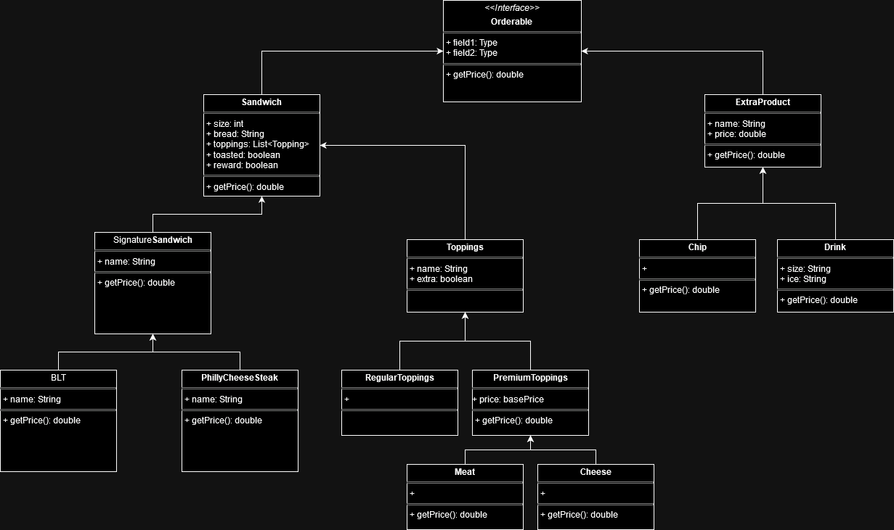
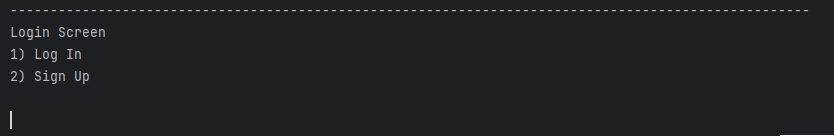
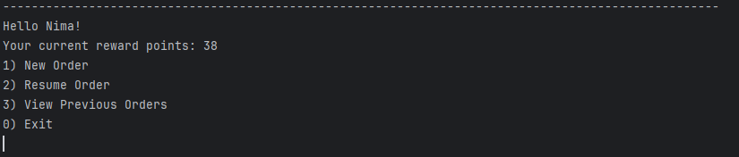
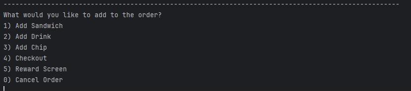
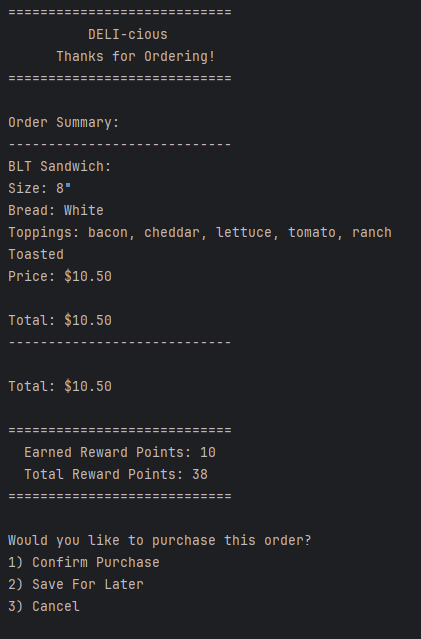
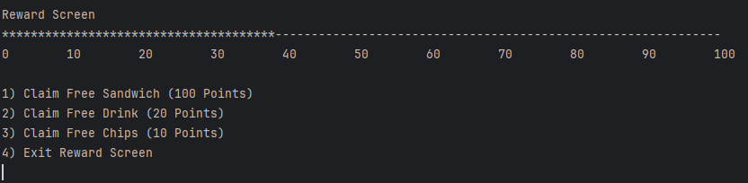
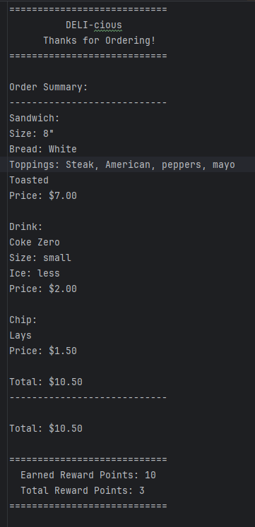
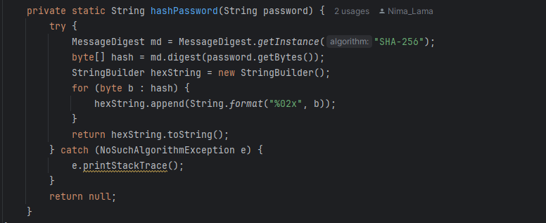

# DELI-cious
### Java CLI Application for a Deli Store Front
## Table of Contents
1. [Overview](#overview)
2. [Features](#features)
   - [User Authentication](#user-authentication)
   - [Order Management](#order-management)
   - [Receipt Saving](#receipt-saving)
   - [Reward Points](#reward-points)
   - [User Data Saving](#user-data-saving)
3. [Getting Started](#getting-started)
   - [Prerequisites](#prerequisites)
   - [Running the Application](#running-the-application)
4. [Code Structure](#code-structure) 
   - [com.pluralsight.menu](#compluralsightmenu)
   - [com.pluralsight](#compluralsight)
   - [com.pluralsight.UI](#compluralsightui)
   - [com.pluralsight.filemanager](#compluralsightfilemanager)
5. [Examples](#examples)
   - [Start Screen](#start-screen)
   - [Login Screen](#login-screen)
   - [Home Screen](#home-screen)
   - [Order Screen](#order-screen)
   - [Checkout](#checkout)
   - [Reward Screen](#reward-screen)
   - [Receipt](#receipt)
6. [Code Snippet](#code-snippet)
## Overview
This project is a Java based application that allows users to place orders, manage their account, track their order history
and earn rewards points that they can redeem. The project includes features such as user authentication, storing user data,
saving receipts, and managing orders with different items.
This project simulates a sandwich deli where customers can choose from a variety of sandwiches, drinks, sides, and toppings.
Users then proceed to checkout, where they can purchase their order. If they are logged in, they can save.
## Features
### User Authentication
Users can sign in or log in and manage their accounts. Each user has:
- Username: Unique to each user for authentication. 
- Password: Used for secure login.
- Saved Orders: Users can save their past orders for quick re-ordering.
- Receipts: A history of all the receipts from their completed orders used to view past orders.
- Reward Points: Points earned based on order value, which can be redeemed for discounts for free items.
### Order Management
The system allows users to create and manage orders. Users can choose from a variety of menu items such as sandwiches, chips, and drinks. Orders are saved for the user, and receipts are generated after completing each order.
- Menu Items: Includes sandwiches (Signature and Build-Your-Own), chips, and drinks.
- Customizable Toppings: Includes regular toppings (lettuce, tomatoes, etc.) and premium toppings (meat and cheese).
### Receipt Saving
After each completed order, the system generates a receipt that is saved in the user’s account for future reference. The receipt includes a list of the items ordered, their prices, and a total cost.
### Reward Points
Users earn reward points based on the value of their orders. These points can be redeemed for discounts or free items (e.g., a free drink).
### User Data Saving
User data, including orders, receipts, and reward points, are saved across sessions, so users can track their history and continue to build up rewards.
their order for a later time.
## Getting Started
### Prerequisites
- Java 8 or higher
- A text editor or IDE (e.g IntelliJ IDEA, Eclipse)
### Running the Application
1. Clone or download the repository to your local machine
2. Open the project in your Java IDE
3. Build the project and run the main application
## Code Structure
The project is organized into different packages and classes, each responsible for specific parts of the system.

### 1. `com.pluralsight.menu`
This package contains classes representing the menu items such as sandwiches, chips, drinks, and toppings. The classes are divided as follows:
### Sandwiches
- `Sandwich`: Base class for all sandwiches.
- `SignatureSandwiches`: Abstract class for all signature sandwiches (e.g. BLT, Philly Cheesesteak).
- `Topping`: Abstract class for all toppings.
- `RegularTopping`: Class representing regular toppings (e.g. lettuce, tomatoes).
- `PremiumTopping`: Abstract class for premium toppings (e.g., meats, cheeses).
### Extras
- `ExtraProduct`: Abstract class for products that can be added to orders, such as chips and drinks.
- `Chip`, `Drink`: Classes representing chips and drinks, with customizable sizes and pricing.
### 2. `com.pluralsight`
This package contains the core logic for user management, order tracking, and storing data.
### User Class
- `User`: Represents a user with a unique username, password, saved orders, receipts, and reward points.
### StoreFront Class
- `StoreFront`: Manages the deli’s menu items and prices, tracks orders, and handles the addition and retrieval of orders.
  - Static Pricing Maps: Defines the price structure for meat, cheese, and drink options.
  - Order Management: Allows adding, retrieving, and clearing orders.
### 3. `com.pluralsight.UI`
This package contains the user interface for the program.
- `UserInterface`: Manages the input and output handling for the main program. Manages adding to, saving, and loading previous orders.
- `LoginUserInterface`: Manages the login for the user
### 4. `com.pluralsight.filemanger`
This package contains classes that manage the saving and loading of user data and receipts.
## Examples
### Start Screen

The start screen is the user's initial landing page, offering the choice to move to the login screen or proceed as a guest.
### Login Screen

The login screen allows the user to register an account or to log in as an existing user.
### Home Screen

The home screen is welcomes in the user and displays their current reward points. The user can then choose to either, add
a new order, resume a previous order, or view previous orders.
### Order Screen

The order screen is where the user can choose which item they would like to add to the order. After building an order they
can choose to proceed with checkout. The user can also move to the reward screen where they can choose a reward to claim.
### Checkout

The checkout screen displays the contents of the order to the user and also displays the cost of the order and the rewards to be gained with the order.
The user has the option to complete the purchase, save the order for later, or to cancel the order.
### Reward Screen

The reward screen displays to the user the users current reward points. It also shows a bar to help visualize the reward points the user currently has.
The user can then choose to claim a reward. For 100 points they can claim a free sandwich, for 20 points they can claim a free drink, and for 
10 points they can claim a free bag of chips.
### Receipt

When the user confirms a purchase, their order is saved as a .txt file, with the file name being the time of purchase.

## Code Snippet

This code snippet demonstrates how the program securely stores user passwords. When a user enters their password, it is
encrypted using a SHA-256 hash. The resulting hashed byte array is then converted to a hexadecimal string, ensuring that 
only the hashed version is stored. This approach prevents storing plaintext passwords, enhancing the security of user data.

[Back to Top](#deli-cious)